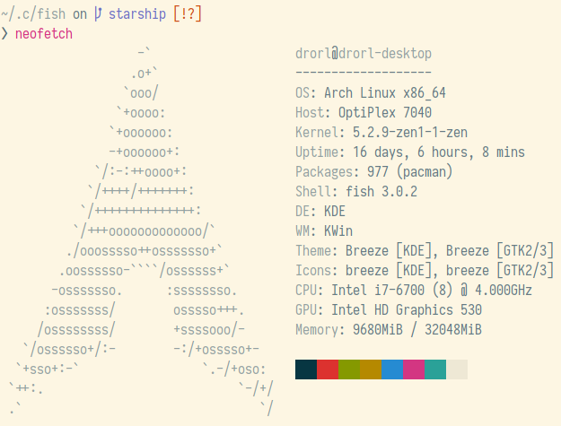

# Fish

Clone this repo to `~/.config`.

## External Tools

This configuration uses the following external tools. It is highly recommended that you install them
using your system's package manager.

* [bat](https://github.com/sharkdp/bat)
* [exa](https://github.com/ogham/exa)
* [fd](https://github.com/sharkdp/fd)
* [fzf](https://github.com/junegunn/fzf)
* [ripgrep](https://github.com/BurntSushi/ripgrep)

If you install fzf using Homebrew then you should to run `/usr/local/opt/fzf/install` in order
to set up the key bindings.
